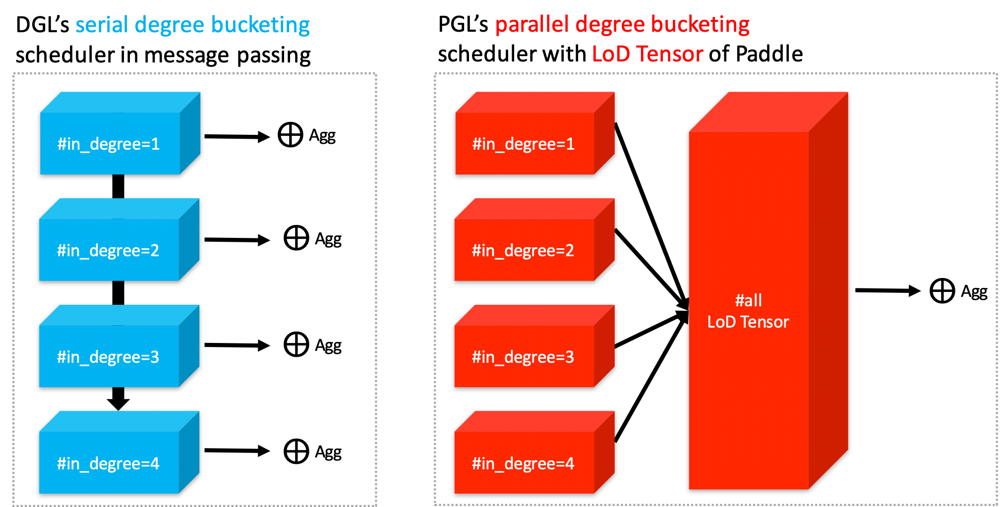

[](https://pypi.org/project/pgl/)
[](./LICENSE)

[DOC](https://pgl.readthedocs.io/en/latest/) | [Quick Start](https://pgl.readthedocs.io/en/latest/quick_start/instruction.html) | [中文](./README.zh.md)

## Breaking News !!

- You can find **ERNIESage**, a novel model for modeling text and graph structures, and its introduction [here](./examples/erniesage/).

- PGL for [Open Graph Benchmark](https://github.com/snap-stanford/ogb) examples can be find [here](./ogb_exmaples/).

- We add newly graph level operators like **GraphPooling** and [**GraphNormalization**](https://arxiv.org/abs/2003.00982) for graph level predictions.

- We relase a PGL-KE toolkit [here](./exmaples/pgl-ke) including classical knowledge graph algorithms like TransE, TransR, RotatE.

------

Paddle Graph Learning (PGL) is an efficient and flexible graph learning framework based on [PaddlePaddle](https://github.com/PaddlePaddle/Paddle).


The newly released PGL supports heterogeneous graph learning on both walk based paradigm and message-passing based paradigm by providing MetaPath sampling and Message Passing mechanism on heterogeneous graph. Furthermor, The newly released PGL also support distributed graph storage and some distributed training algorithms, such as distributed deep walk and distributed graphsage. Combined with the PaddlePaddle deep learning framework, we are able to support both graph representation learning models and graph neural networks, and thus our framework has a wide range of graph-based applications.


## Highlight: Efficiency - Support Scatter-Gather and LodTensor Message Passing

One of the most important benefits of graph neural networks compared to other models is the ability to use node-to-node connectivity information, but coding the communication between nodes is very cumbersome. At PGL we adopt **Message Passing Paradigm** similar to [DGL](https://github.com/dmlc/dgl) to help to build a customize graph neural network easily. Users only need to write ```send``` and ```recv``` functions to easily implement a simple GCN. As shown in the following figure, for the first step the send function is defined on the edges of the graph, and the user can customize the send function  to send the message from the source to the target node. For the second step, the recv function  is responsible for aggregating  messages together from different sources.


As shown in the left of the following figure, to adapt general user-defined message aggregate functions, DGL uses the degree bucketing method to combine nodes with the same degree into a batch and then apply an aggregate function  on each batch serially. For our PGL UDF aggregate function, we organize the message as a [LodTensor](http://www.paddlepaddle.org/documentation/docs/en/1.4/user_guides/howto/basic_concept/lod_tensor_en.html) in [PaddlePaddle](https://github.com/PaddlePaddle/Paddle) taking the message as variable length sequences. And we **utilize the features of LodTensor in Paddle to obtain fast parallel aggregation**.





Users only need to call the ```sequence_ops``` functions provided by Paddle to easily implement efficient message aggregation. For examples, using ```sequence_pool``` to sum the neighbor message.
```python
    import paddle.fluid as fluid
    def recv(msg):
        return fluid.layers.sequence_pool(msg, "sum")
```


Although DGL does some kernel fusion optimization for general sum, max and other aggregate functions with scatter-gather. For **complex user-defined functions** with degree bucketing algorithm, the serial execution for each degree bucket cannot take full advantage of the performance improvement provided by GPU. However, operations on the PGL LodTensor-based message is performed in parallel, which can fully utilize GPU parallel optimization. In our experiments, PGL can reach up to 13 times the speed of DGL with complex user-defined functions. Even without scatter-gather optimization, PGL still has excellent performance. Of course, we still provide build-in scatter-optimized message aggregation functions.

### Performance


We test all the following GNN algorithms with Tesla V100-SXM2-16G running for 200 epochs to get average speeds. And we report the accuracy on test dataset without early stoppping.

| Dataset | Model |  PGL Accuracy | PGL speed (epoch time) | DGL 0.3.0 speed (epoch time) |
| -------- | ----- | ----------------- | ------------ | ------------------------------------ |
| Cora | GCN |81.75% | 0.0047s | **0.0045s** |
| Cora | GAT | 83.5% | **0.0119s** | 0.0141s |
| Pubmed | GCN |79.2% |**0.0049s** |0.0051s |
| Pubmed | GAT | 77% |0.0193s|**0.0144s**|
| Citeseer | GCN |70.2%| **0.0045** |0.0046s|
| Citeseer | GAT |68.8%| **0.0124s** |0.0139s|


If we use complex user-defined aggregation like [GraphSAGE-LSTM](https://cs.stanford.edu/people/jure/pubs/graphsage-nips17.pdf) that aggregates neighbor features with LSTM ignoring the order of recieved messages, the optimized message-passing in DGL will be forced to degenerate into degree bucketing scheme. The speed performance will be much slower than the one implemented in PGL. Performances may be various with different scale of the graph, in our experiments, PGL can reach up to 13 times the speed of DGL.

| Dataset |   PGL speed (epoch time) | DGL 0.3.0 speed (epoch time) | Speed up|
| -------- |  ------------ | ------------------------------------ |----|
| Cora | **0.0186s** | 0.1638s | 8.80x|
| Pubmed | **0.0388s** |0.5275s | 13.59x|
| Citeseer | **0.0150s** | 0.1278s | 8.52x |

## Highlight: Flexibility - Natively Support Heterogeneous Graph Learning

Graph can conveniently represent the relation between things in the real world, but the categories of things and the relation between things are various. Therefore, in the heterogeneous graph, we need to distinguish the node types and edge types in the graph network. PGL models heterogeneous graphs that contain multiple node types and multiple edge types, and can describe complex connections between different types.

### Support meta path walk sampling on heterogeneous graph


The left side of the figure above describes a shopping social network. The nodes above have two categories of users and goods, and the relations between users and users, users and goods, and goods and goods. The right of the above figure is a simple sampling process of MetaPath. When you input any MetaPath as UPU (user-product-user), you will find the following results

Then on this basis, and introducing word2vec and other methods to support learning metapath2vec and other algorithms of heterogeneous graph representation.

### Support Message Passing mechanism on heterogeneous graph


Because of the different node types on the heterogeneous graph, the message delivery is also different. As shown on the left, it has five neighbors, belonging to two different node types. As shown on the right of the figure above, nodes belonging to different types need to be aggregated separately during message delivery, and then merged into the final message to update the target node. On this basis, PGL supports heterogeneous graph algorithms based on message passing, such as GATNE and other algorithms.


## Large-Scale: Support distributed graph storage and distributed training algorithms
In most cases of large-scale graph learning, we need distributed graph storage and distributed training support. As shown in the following figure, PGL provided a general solution of large-scale training, we adopted [PaddleFleet](https://github.com/PaddlePaddle/Fleet) as our distributed parameter servers, which supports large scale distributed embeddings and a lightweighted distributed storage engine so it can easily set up a large scale distributed training algorithm with MPI clusters.


## Model Zoo
The following are 14 graph learning models that have been implemented in the framework. See the details [here](https://pgl.readthedocs.io/en/latest/introduction.html#highlight-tons-of-models)

|Model | feature |
|---|---|
| [**ERNIESage**](./examples/erniesage/) | ERNIE SAmple aggreGatE for Text and Graph |
| GCN | Graph Convolutional Neural Networks |
| GAT | Graph Attention Network |
| GraphSage |Large-scale graph convolution network based on neighborhood sampling|
| unSup-GraphSage | Unsupervised GraphSAGE |
| LINE | Representation learning based on first-order and second-order neighbors |
| DeepWalk | Representation learning by DFS random walk |
| MetaPath2Vec | Representation learning based on metapath |
| Node2Vec | The representation learning Combined with DFS and BFS  |
| Struct2Vec | Representation learning based on structural similarity |
| SGC | Simplified graph convolution neural network |
| GES | The graph represents learning method with node features |
| DGI | Unsupervised representation learning based on graph convolution network |
| GATNE | Representation Learning of Heterogeneous Graph based on MessagePassing |

The above models consists of three parts, namely, graph representation learning, graph neural network and heterogeneous graph learning, which are also divided into graph representation learning and graph neural network.

## System requirements

PGL requires:

* paddle >= 1.6
* cython


PGL supports both Python 2 & 3


## Installation

You can simply install it via pip.

```sh
pip install pgl
```

## The Team

PGL is developed and maintained by NLP and Paddle Teams at Baidu

E-mail: nlp-gnn[at]baidu.com

## License

PGL uses Apache License 2.0.
