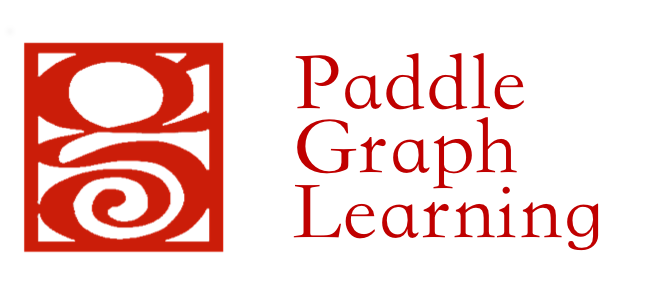
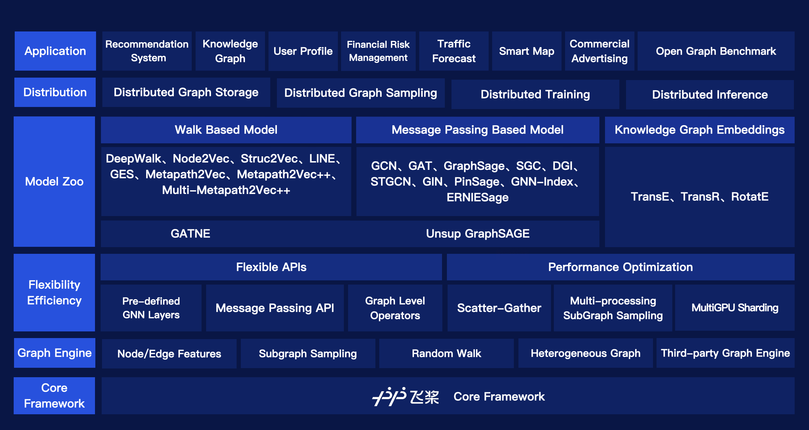
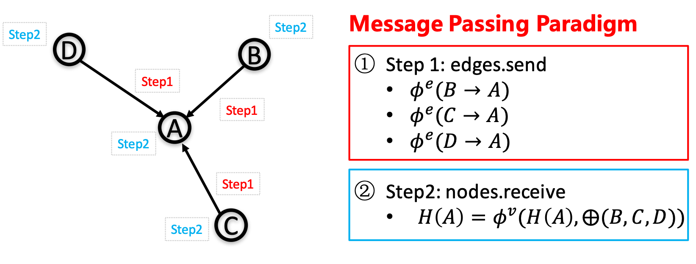

[](https://pypi.org/project/pgl/)
[](./LICENSE)

[DOC](https://pgl.readthedocs.io/en/latest/) | [Quick Start](https://pgl.readthedocs.io/en/latest/quick_start/instruction.html) | [中文](./README.zh.md)

## Breaking News !!

**One amazing paper about knowledge representation learning was accepted!** (2022.05.06)

- Simple and Effective Relation-based Embedding Propagation for Knowledge Representation Learning, to appear in **IJCAI2022**. Code can be found [here](./apps/Graph4KG/examples/REP).


PGL v2.2 2021.12.20

- **Graph4Rec**: We released a universal and large-scale toolkit with graph neural networks for recommender systems. Details can be found [here](./apps/Graph4Rec).

- **Graph4KG**: We released a flexible framework named Graph4KG to learn embeddings of entities and relations in KGs, which supports training on massive KGs. Details can be found [here](./apps/Graph4KG).

- **GNNAutoScale**: PGL now supports GNNAutoScale framework, which can scale arbitrary message-passing GNNs to large graphs. Details can be found [here](./apps/GNNAutoScale).


&#x1F525; &#x1F525; &#x1F525; **OGB-LSC KDD CUP 2021 winners announced!!**  (2021.06.17)


Super excited to announce our PGL team won <font color=Red>**TWO FIRST**</font> place and <font color=Red>**ONE SECOND**</font> place in a total of three track in OGB-LSC KDD CUP 2021.
Leaderboards can be found [here](https://ogb.stanford.edu/kddcup2021/results/).

- **First place in MAG240M-LSC track**: Code and Technical Report can be found [here](./examples/kddcup2021/MAG240M/r_unimp).

- **First place in WikiKG90M-LSC track**: Code and Technical Report can be found [here](./examples/kddcup2021/WikiKG90M).

- **Second place in PCQM4M-LSC track**: Code and Technical Report can be found [here](./examples/kddcup2021/PCQM4M).

**Two amazing paper using PGL are accepted:** (2021.06.17)

- Masked Label Prediction: Unified Message Passing Model for Semi-Supervised Classification, to appear in **IJCAI2021**.
- HGAMN: Heterogeneous Graph Attention Matching Network for Multilingual POI Retrieval at Baidu Maps, to appear in **KDD2021**.

**PGL Dstributed Graph Engine API released!!**

- Our Dstributed Graph Engine API has been released and we developed a [tutorial](./tutorials/working_with_distributed_graph_engine.ipynb) to show how to launch a graph engine and a [demo](./examples/metapath2vec) for training model using graph engine.


------

Paddle Graph Learning (PGL) is an efficient and flexible graph learning framework based on [PaddlePaddle](https://github.com/PaddlePaddle/Paddle).




The newly released PGL supports heterogeneous graph learning on both walk based paradigm and message-passing based paradigm by providing MetaPath sampling and Message Passing mechanism on heterogeneous graph. Furthermor, The newly released PGL also support distributed graph storage and some distributed training algorithms, such as distributed deep walk and distributed graphsage. Combined with the PaddlePaddle deep learning framework, we are able to support both graph representation learning models and graph neural networks, and thus our framework has a wide range of graph-based applications.


One of the most important benefits of graph neural networks compared to other models is the ability to use node-to-node connectivity information, but coding the communication between nodes is very cumbersome. At PGL we adopt **Message Passing Paradigm** similar to [DGL](https://github.com/dmlc/dgl) to help to build a customize graph neural network easily. Users only need to write ```send``` and ```recv``` functions to easily implement a simple GCN. As shown in the following figure, for the first step the send function is defined on the edges of the graph, and the user can customize the send function  to send the message from the source to the target node. For the second step, the recv function  is responsible for aggregating  messages together from different sources.




To write a sum aggregator, users only need to write the following codes.

```python

    import pgl
    import paddle
    import numpy as np

    
    num_nodes = 5
    edges = [(0, 1), (1, 2), (3, 4)]
    feature = np.random.randn(5, 100).astype(np.float32)

    g = pgl.Graph(num_nodes=num_nodes,
        edges=edges,
        node_feat={
            "h": feature
        })
    g.tensor()

    def send_func(src_feat, dst_feat, edge_feat):
        return src_feat

    def recv_func(msg):
        return msg.reduce_sum(msg["h"]) 
     
    msg = g.send(send_func, src_feat=g.node_feat)

    ret = g.recv(recv_func, msg)

```


## Highlight: Flexibility - Natively Support Heterogeneous Graph Learning

Graph can conveniently represent the relation between things in the real world, but the categories of things and the relation between things are various. Therefore, in the heterogeneous graph, we need to distinguish the node types and edge types in the graph network. PGL models heterogeneous graphs that contain multiple node types and multiple edge types, and can describe complex connections between different types.

### Support meta path walk sampling on heterogeneous graph


The left side of the figure above describes a shopping social network. The nodes above have two categories of users and goods, and the relations between users and users, users and goods, and goods and goods. The right of the above figure is a simple sampling process of MetaPath. When you input any MetaPath as UPU (user-product-user), you will find the following results

Then on this basis, and introducing word2vec and other methods to support learning metapath2vec and other algorithms of heterogeneous graph representation.

### Support Message Passing mechanism on heterogeneous graph


Because of the different node types on the heterogeneous graph, the message delivery is also different. As shown on the left, it has five neighbors, belonging to two different node types. As shown on the right of the figure above, nodes belonging to different types need to be aggregated separately during message delivery, and then merged into the final message to update the target node. On this basis, PGL supports heterogeneous graph algorithms based on message passing, such as GATNE and other algorithms.


## Large-Scale: Support distributed graph storage and distributed training algorithms

In most cases of large-scale graph learning, we need distributed graph storage and distributed training support. As shown in the following figure, PGL provided a general solution of large-scale training, we adopted [PaddleFleet](https://github.com/PaddlePaddle/Fleet) as our distributed parameter servers, which supports large scale distributed embeddings and a lightweighted distributed storage engine so it can easily set up a large scale distributed training algorithm with MPI clusters.


## Model Zoo

The following graph learning models have been implemented in the framework. You can find more [examples](./examples) and the details [here](https://pgl.readthedocs.io/en/latest/introduction.html#highlight-tons-of-models).

|Model | feature |
|---|---|
| [ERNIESage](./legacy/examples/erniesage/) | ERNIE SAmple aggreGatE for Text and Graph |
| [GCN](./examples/gcn/) | Graph Convolutional Neural Networks |
| [GAT](./examples/gat/) | Graph Attention Network |
| [GraphSage](./examples/graphsage/) |Large-scale graph convolution network based on neighborhood sampling|
| [unSup-GraphSage](./legacy/examples/unsup_graphsage/) | Unsupervised GraphSAGE |
| [LINE](./legacy/examples/line/) | Representation learning based on first-order and second-order neighbors |
| [DeepWalk](./examples/deepwalk/) | Representation learning by DFS random walk |
| [MetaPath2Vec](./legacy/examples/metapath2vec/) | Representation learning based on metapath |
| [Node2Vec](./legacy/examples/node2vec/) | The representation learning Combined with DFS and BFS  |
| [Struct2Vec](./legacy/examples/strucvec/) | Representation learning based on structural similarity |
| [SGC](./legacy/examples/sgc/) | Simplified graph convolution neural network |
| [GES](./legacy/examples/ges/) | The graph represents learning method with node features |
| [DGI](./legacy/examples/dgi/) | Unsupervised representation learning based on graph convolution network |
| [GATNE](./legacy/examples/GATNE) | Representation Learning of Heterogeneous Graph based on MessagePassing |

The above models consists of three parts, namely, graph representation learning, graph neural network and heterogeneous graph learning, which are also divided into graph representation learning and graph neural network.

## System requirements

PGL requires:

* paddlepaddle >= 2.2.0 
* cython


PGL only supports Python 3


## Installation

You can simply install it via pip.

```sh
pip install pgl
```

## The Team

PGL is developed and maintained by NLP and Paddle Teams at Baidu

E-mail: nlp-gnn[at]baidu.com

## License

PGL uses Apache License 2.0.
