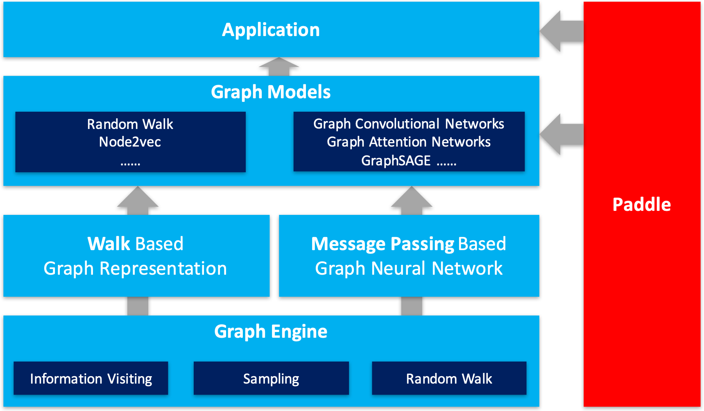

[](https://pypi.org/project/pgl/)
[](./LICENSE)

[文档](https://pgl.readthedocs.io/en/latest/) | [快速开始](https://pgl.readthedocs.io/en/latest/quick_start/instruction.html) | [English](./README.md)

## 最新消息

**一篇关于知识表示学习的论文被接收！！**(2022.05.06)

- Simple and Effective Relation-based Embedding Propagation for Knowledge Representation Learning, **IJCAI2022**. 相关代码可以查看[这里](./apps/Graph4KG/examples/REP)。


PGL v2.2 2021.12.20

- **Graph4Rec**: 我们发布了一个用于推荐系统的通用大规模分布式图表示学习工具包，详情请参考[这里](./apps/Graph4Rec)。

- **Graph4KG**: 我们发布了一个用于大规模知识图谱表示学习的工具包，详情请参考[这里](./apps/Graph4KG)。

- **GNNAutoScale**: PGL现在支持GNNAutoScale框架了，这是一个用于图学习异构设备训练的工具包，详情请参考[这里](./apps/GNNAutoScale)。


&#x1F525; &#x1F525; &#x1F525; **OGB-LSC KDD CUP 2021 冠军宣布!!**  (2021.06.17)

非常兴奋地宣布，我们PGL团队在 OGB-LSC KDD CUP 2021 的三个赛道中获得了<font color=Red>**两个冠军**</font>和<font color=Red>**一个亚军**</font>。官方排行榜可以参考[这里](https://ogb.stanford.edu/kddcup2021/results/).


- **MAG240M-LSC 赛道第一名**: 代码和技术报告可以参考[这里](./examples/kddcup2021/MAG240M/r_unimp).

- **WikiKG90M-LSC 赛道第一名**: 代码和技术报告可以参考[这里](./examples/kddcup2021/WikiKG90M).

- **PCQM4M-LSC 赛道第二名**: 代码和技术报告可以参考[这里](./examples/kddcup2021/PCQM4M).

**两篇使用PGL的论文被接收！！** (2021.06.17)

- Masked Label Prediction: Unified Message Passing Model for Semi-Supervised Classification, to appear in **IJCAI2021**.
- HGAMN: Heterogeneous Graph Attention Matching Network for Multilingual POI Retrieval at Baidu Maps, to appear in **KDD2021**.


------

Paddle Graph Learning (PGL)是一个基于[PaddlePaddle](https://github.com/PaddlePaddle/Paddle)的高效易用的图学习框架



在最新发布的PGL中引入了异构图的支持，新增MetaPath采样支持异构图表示学习，新增异构图Message Passing机制支持基于消息传递的异构图算法，利用新增的异构图接口，能轻松搭建前沿的异构图学习算法。而且，在最新发布的PGL中，同时也增加了分布式图存储以及一些分布式图学习训练算法，例如，分布式deep walk和分布式graphsage。结合PaddlePaddle深度学习框架，我们的框架基本能够覆盖大部分的图网络应用，包括图表示学习以及图神经网络。


对比于一般的模型，图神经网络模型最大的优势在于它利用了节点与节点之间连接的信息。但是，如何通过代码来实现建模这些节点连接十分的麻烦。PGL采用与[DGL](https://github.com/dmlc/dgl)相似的**消息传递范式**用于作为构建图神经网络的接口。用于只需要简单的编写```send```还有```recv```函数就能够轻松的实现一个简单的GCN网络。如下图所示，首先，send函数被定义在节点之间的边上，用户自定义send函数会把消息从源点发送到目标节点。然后，recv函数负责将这些消息用汇聚函数  汇聚起来。


用户只需要下面简单几行代码，就可以实现一个求和聚合函数了。

```python

    import pgl
    import paddle
    import numpy as np

    
    num_nodes = 5
    edges = [(0, 1), (1, 2), (3, 4)]
    feature = np.random.randn(5, 100).astype(np.float32)

    g = pgl.Graph(num_nodes=num_nodes,
        edges=edges,
        node_feat={
            "h": feature
        })
    g.tensor()

    def send_func(src_feat, dst_feat, edge_feat):
        return src_feat

    def recv_func(msg):
        return msg.reduce_sum(msg["h"]) 
     
    msg = g.send(send_func, src_feat=g.node_feat)

    ret = g.recv(recv_func, msg)

```


## 特色：易用性——原生支持异构图

图可以很方便的表示真实世界中事物之间的联系，但是事物的类别以及事物之间的联系多种多样，因此，在异构图中，我们需要对图网络中的节点类型以及边类型进行区分。PGL针对异构图包含多种节点类型和多种边类型的特点进行建模，可以描述不同类型之间的复杂联系。

### 支持异构图MetaPath walk采样

上图左边描述的是一个购物的社交网络，上面的节点有用户和商品两大类，关系有用户和用户之间的关系，用户和商品之间的关系以及商品和商品之间的关系。上图的右边是一个简单的MetaPath采样过程，输入metapath为UPU（user-product-user），采出结果为

然后在此基础上引入word2vec等方法，支持异构图表示学习metapath2vec等算法。

### 支持异构图Message Passing机制


在异构图上由于节点类型不同，消息传递也方式也有所不同。如上图左边，它有五个邻居节点，属于两种不同的节点类型。如上图右边，在消息传递的时候需要把属于不同类型的节点分开聚合，然后在合并成最终的消息，从而更新目标节点。在此基础上PGL支持基于消息传递的异构图算法，如GATNE等算法。


## 特色：规模性——支持分布式图存储以及分布式学习算法

在大规模的图网络学习中，通常需要多机图存储以及多机分布式训练。如下图所示，PGL提供一套大规模训练的解决方案，我们利用[PaddleFleet](https://github.com/PaddlePaddle/Fleet)(支持大规模分布式Embedding学习)作为我们参数服务器模块以及一套简易的分布式存储方案，可以轻松在MPI集群上搭建分布式大规模图学习方法。


## 丰富性——覆盖业界大部分图学习网络

下列是框架中部分已经实现的图网络模型，更多的模型在[这里](./examples)可以找到。详情请参考[这里](https://pgl.readthedocs.io/en/latest/introduction.html#highlight-tons-of-models)

| 模型 | 特点 |
|---|---|
| [**ERNIESage**](./legacy/examples/erniesage/) | 能同时建模文本以及图结构的ERNIE SAmple aggreGatE |
| [GCN](./examples/gcn/) | 图卷积网络 |
| [GAT](./examples/gat/) | 基于Attention的图卷积网络 |
| [GraphSage](./examples/graphsage/) | 基于邻居采样的大规模图卷积网络 |
| [unSup-GraphSage](./legacy/examples/unsup_graphsage/) | 无监督学习的GraphSAGE |  
| [LINE](./legacy/examples/line/) | 基于一阶、二阶邻居的表示学习 |  
| [DeepWalk](./examples/deepwalk/) | DFS随机游走的表示学习 |  
| [MetaPath2Vec](./legacy/examples/metapath2vec/) | 基于metapath的表示学习 |
| [Node2Vec](./legacy/examples/node2vec/) | 结合DFS及BFS的表示学习 | 
| [Struct2Vec](./legacy/examples/strucvec/) | 基于结构相似的表示学习 |
| [SGC](./legacy/examples/sgc/) | 简化的图卷积网络 | 
| [GES](./legacy/examples/ges/) | 加入节点特征的图表示学习方法 | 
| [DGI](./legacy/examples/dgi/) | 基于图卷积网络的无监督表示学习 |
| [GATNE](./legacy/examples/GATNE) | 基于MessagePassing的异构图表示学习 |

上述模型包含图表示学习，图神经网络以及异构图三部分，而异构图里面也分图表示学习和图神经网络。


## 依赖

PGL依赖于:

* paddlepaddle >= 2.2.0 
* cython


PGL支持Python 3。


## 安装

你可以简单的用pip进行安装。

```sh
pip install pgl
```

## 团队

PGL由百度的NLP以及Paddle团队共同开发以及维护。

联系方式 E-mail: nlp-gnn[at]baidu.com

## License

PGL uses Apache License 2.0.
