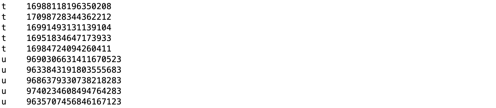

## PGLBox: Distributed Hierarchical GPU Engine for Efficiently Training Super-large Scale Graph Neural Network


**PGLBox**是基于**GPU**的超大规模图模型训练引擎，通过异构层次化存储技术，突破了显存瓶颈，单机即可支持百亿节点、数百亿边的采样和训练。通过PGLBox你可以简单地通过配置，利用单机多卡训练大规模的图表示学习，以此来搭建快速基于GNN的推荐系统、用户画像、图检索系统。

<h4 align="center">
  <a href=#快速开始> 快速开始 </a> |
  <a href=#特性> 特性 </a> |
  安装 |
  模型部署
</h4>

## 快速开始

为了我们可以快速使用PGLBox的能力，我们提供了一些相应的镜像环境，只需要拉取相关硬件的镜像，然后完成数据的配置，就可以一键跑起图模型。
```
docker pull registry.baidubce.com/paddlepaddle/pgl:pglbox-1.0rc-cuda11.0-cudnn8
```
拉取好docker之后，我们先下载PGLBox的代码，并进入PGLBox目录
```
git clone https://github.com/PaddlePaddle/PGL
cd PGL/apps/PGLBox
```
放置一些我们训练图表示模型必要的数据，例如节点编号文件以及边文件，详情可见后续介绍。这里提供一份大规模学术引用网络的数据MAG240M，以供快速测试。解压数据文件到当前目录。
```
wget https://baidu-pgl.gz.bcebos.com/pglbox/data/MAG240M/preproceesed_mag240m.tar
tar -xvf preproceesed_mag240m.tar
```
按照图的结构信息，以及需要的模型配置我们的配置文件，可以直接使用我们提供的这份配置。具体配置含义我们会在后面进行解释。
```
cat user_configs/mag240m_metapath2vec.yaml
```
在PGLBox主目录下通过`nvidia-docker run`命令运行模型
```
nvidia-docker run -it --rm \
    --name pglbox_docker \
    --network host \
    --ipc=host \
    -v ${PWD}:/pglbox \
    -w /pglbox \
    registry.baidubce.com/paddlepaddle/pgl:pglbox-1.0rc-cuda11.0-cudnn8 \
    /bin/bash -c "/pglbox/train.sh ./user_configs/mag240m_metapath2vec.yaml"
```
训练完成后，我们可以在主目录下找到`mag240m_output`文件夹，该文件夹下包含了`model`和`embedding`两个文件夹，分别表示保存的模型以及infer产出的节点embedding。

## 特性


#### <a href=#纯GPU框架的加速体验> 🚀 纯GPU框架的加速体验 </a>

#### <a href=#一键式配置化的复杂GNN模型支持>  📦 一键式配置化的复杂GNN模型支持 </a>

#### <a href=#提供丰富场景化解决方案> 📖 提供丰富场景化解决方案</a>

### 纯GPU框架的加速体验

在2021年底我们开源了[Graph4Rec](https://github.com/PaddlePaddle/PGL/tree/main/apps/Graph4Rec)工具库，主要用于大规模推荐场景下的图节点表示学习，该工具库主要用于多CPU场景下的大规模训练，并没有利用上GPU的快速计算能力。因此，今年我们开源了PGLBox纯GPU训练框架，将Graph4Rec从CPU迁移到了GPU，大大提升了模型训练速度。在我们内部进行速度测试时，相同数据量和模型配置下，PGLBox的速度相比Graph4Rec速度在同成本下**提升了27倍**。

### 一键式配置化的复杂GNN模型支持
在工业级图表示学习算法中，除了对图的规模要求高之外，还有复杂特征融合、游走策略、图聚合方式、算法组合多样化和例行训练等需求。我们延续Graph4Rec的设计策略，将这些现实问题，抽象成5个配置模块，通过5项配置，即刻完成复杂的GNN支持，适配**异构图神经网络**，**元路径随机游走**，**大规模稀疏特征**等复杂场景。我们也在`user_config`里面提供大量不同设置下的模型配置，供用户做选择。

<h2 align="center">

</h2>

总体来讲，完成自定义的配置，需要完成**图数据准备**，**路径配置**，**采样配置**，**样本配置**，**GNN配置**。不同配置下，由于样本量和模型的计算复杂度不一样，耗时和效果差异也比较大，我们提供了一份在标准数据上，各个不同配置的耗时展示（TBD），以供参考。

<details><summary>图数据的准备</summary>
<br/>
假如节点类型有u, t, f三种类型的节点. 边有u2t(u – t), u2f(u – f), t2f(t – f) 三种边。 那么我们需要有边文件和节点类型文件。
<br/><br/>

**节点类型文件准备**

节点类型文件的格式为:
``` shell
node_type \t node_id
```
其中，`node_type`是节点的类型，例如为u、t、f。而`node_id`为**uint64**的数字，**但注意不能为0**。
<h2 align="left">

</h2>

- 边文件准备

xxxxx

</details>

<details><summary>路径配置</summary>
</details>

<details><summary>采样配置</summary>
</details>

<details><summary>GNN配置</summary>
</details>

### 提供丰富场景化解决方案 

下面我们给出若干使用**PGLBox**来完成的场景化案例，用户跟随场景教程，替换数据以及配置，即可完成相应的模型训练和部署。

TBD
