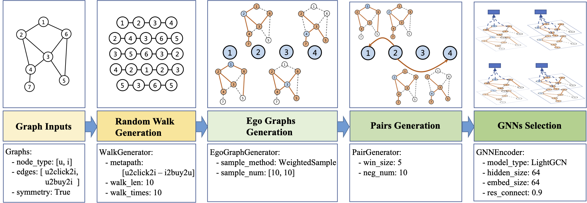

# PGLBox: Distributed Hierarchical GPU Engine for Efficiently Training Super-large Scale Graph Neural Network

PGLBox is a distributed GPU-based engine for training super-large graph models. It breaks the memory bottleneck through hierarchical heterogeneous storage technology, and can support graph sampling and training with billions of nodes and hundreds of billions of edges on a single machine. Users only need to configure the configuration file to train large-scale graph representation learning with a single machine with multi-cards, and can quickly build GNN-based recommendation systems, user profiles, and graph retrieval systems.

<h4 align="center">
  <a href=#Quick Start> Quick Start </a> |
  <a href=#Data Format> Data Format </a> |
  <a href=#Features> Features </a> |
  Installation |
  Model Deployment
</h4>

## Changelog

- v2.2: Add new functions, including weighted sampling, returning edge weight and supporting new GNN model layer TransformerConv, etc. (2023.04.18)
- v2.1: Update some codes, including [adding specify training or infer nodes](./wiki/train_infer_from_file_en.md), and [routine training](./wiki/online_train_en.md). (2023.03.08)
- v2.0: Release PGLBox V2 version, which supports feature and embedding multi-level storage, and supports larger graph scale. (2022.12.29)
- v1.0: Newly added PGLBox, V1 version. (2022.12.14)

## Quick Start

To quickly use PGLBox's capabilities, we provide some corresponding mirror environments. You only need to pull the mirror of the relevant hardware, download the corresponding data, and modify the configuration file, then you can run it with one click. Currently, PGLBox only supports running on two GPU hardware, v100 and a100.

```
docker pull registry.baidubce.com/paddlepaddle/pgl:pglbox-2.1-cuda11.0-cudnn8
```

After pulling the docker, we first download the code of PGLBox and enter the PGLBox directory.

```
git clone https://github.com/PaddlePaddle/PGL
cd PGL/apps/PGLBox
```

After entering the directory, we only need to place some graph data necessary for training the graph representation model, such as node files and edge files. The data format will be introduced in detail later, and a large-scale academic citation network data MAG240M is provided here for quick start. Unzip the data file to the current directory.

```
wget https://baidu-pgl.gz.bcebos.com/pglbox/data/MAG240M/preprocessed_MAG240M.tar.gz
tar -zxf preprocessed_MAG240M.tar.gz
```

According to the structure information of the graph and the model configuration we need, we can directly use the [configuration file](./demo_configs/mag240m_metapath2vec.yaml) we provide. We will explain the specific configuration meaning later. Run the model through the nvidia-docker run command in the PGLBox main directory.

```
nvidia-docker run -it --rm \
    --name pglbox_docker \
    --network host \
    --ipc=host \
    -v ${PWD}:/pglbox \
    -w /pglbox \
    registry.baidubce.com/paddlepaddle/pgl:pglbox-2.1-cuda11.0-cudnn8 \
    /bin/bash -c "/pglbox/scripts/train.sh ./demo_configs/mag240m_metapath2vec.yaml"
```

After the training is completed, we can find the `mag240m_output` folder in the main directory. This folder contains two subfolders: `model` and `embedding`, which respectively represent the saved model and the node embedding produced by infererence.

## Data Format

Please refer to [here](./wiki/data_format_en.md) for detailed introduction to the graph data format and data preprocessing.

## Features

#### <a href=#Accelerated-experience-of-pure-GPU-framework> 🚀 Accelerated experience of pure GPU framework </a>

#### <a href=#One-click-configurable-support-for-complex-GNN-models> 📦 One-click configurable support for complex GNN models </a>

#### <a href=#Provide-rich-scenario-based-solutions> 📖 Provide rich scenario-based solutions </a>

### Accelerated experience of pure GPU framework

At the end of 2021, we open-sourced the Graph4Rec tool library, which is mainly used for graph node representation learning in large-scale recommendation scenarios. This tool is mainly used for large-scale training in multi-CPU scenarios and does not make use of the fast computing power of GPUs. Therefore, this year we open-sourced the PGLBox pure GPU training framework, which migrates the entire process of Graph4Rec from CPU to GPU, greatly improving the overall training speed of the model. (Speed data TBD)

### One-click configurable support for complex GNN models

In industrial-level graph representation learning algorithms, in addition to the high requirements for the scale of the graph, there are also demands for complex feature fusion, traversal strategies, graph aggregation methods, diversified algorithm combinations, and routine training. We continue the design strategy of Graph4Rec and abstract these real-world problems into several configuration modules, which can complete the support for complex GNNs, adapt to heterogeneous graph neural networks, metapath random walks, large-scale sparse features, and other complex scenarios. We also provide model configuration files under different settings in the `./user_configs` directory for users to choose.

<h2 align="center">

</h2>

Overall, to complete custom configuration, it is necessary to complete graph data preparation, graph traversal configuration, GNN configuration, training parameter configuration, etc. Due to the different sample sizes and model computing complexities under different configurations, the time consumption and effect differences are also relatively large.

<details><summary>Graph data preparation</summary>
Please refer to [here](./wiki/data_format_en.md) for graph data preparation. By default, PGLBox will train all nodes in the graph data and predict the embeddings of all nodes. If users only want to train a part of the nodes or predict only part of the nodes, PGLBox provides corresponding usage support, please refer to [here](./wiki/train_infer_from_file_en.md).
<br/>
</details>

<details><summary>Graph traversal configuration</summary>
<br/>
Graph traversal configuration is mainly used to control the specific parameters of the graph traversal model. Specifically as follows.
``` shell
# Metapath parameters, configure the traversal path on the graph. Here we take the MAG240M graph data as an example.
meta_path: "author2inst-inst2author;author2paper-paper2author;inst2author-author2paper-paper2author-author2inst;paper2paper-paper2author-author2paper"

# Window size of positive samples on traversal paths.
win_size: 3

# Number of negative samples corresponding to each positive sample.
neg_num: 5

# The depth of metapath traversal path.
walk_len: 24

# Each starting node repeats walk_times traversal, which can traverse all neighbors of a node as much as possible, making training more uniform.
walk_times: 10
```
</details>

<details><summary>GNN configuration</summary>
<br/>
The above graph traversal configuration is mainly for configuring the parameters of models such as metapath2vec. On this basis, if we want to train more complex GNN networks, we can set the relevant configuration items of the GNN network to adjust the model.

``` shell
# GNN model switch
sage_mode: True

# Selection of different GNN models, including LightGCN, GAT, GIN, etc. For details, please refer to the model folder of PGLBox.
sage_layer_type: "LightGCN"

# The weight ratio of node embedding itself (sage_alpha) and node embedding after GNN aggregation (1-sage_alpha).
sage_alpha: 0.9

# Number of nodes' neighbors sampled by the graph model during training.
samples: [5]

# Number of nodes' neighbors sampled by the graph model during inference.
infer_samples: [100]

# Selection of the activation layer of the GNN model.
sage_act: "relu"
```
</details>

<details><summary>Model training parameter configuration</summary>
<br/>
Apart from the aforementioned configurations, here are some relatively important configuration items listed below:

``` shell
# Model type selection, currently the default value is not changed. We will provide more options later, such as ErnieSageModel, etc.
model_type: GNNModel

# Embedding dimension.
embed_size: 64

# Sparse parameter server optimizer, currently supports `adagrad` and `shared_adam`.
sparse_type: adagrad

# Sparse parameter server learning rate.
sparse_lr: 0.05

# Loss function, currently supports hinge, sigmoid, nce.
loss_type: nce

# Whether to train the model. If you only want to perform inference, you can turn off `need_train`.
need_train: True

# Whether to perform inference. If you only want to train the model, you can turn off `need_inference`.
need_inference: True

# Number of training epochs.
epochs: 1

# Batch size of training samples.
batch_size: 80000

# Batch size of inference samples.
infer_batch_size: 80000

# Frequency of triggering SSD cache.
save_cache_frequency: 4

# How many pass datasets to cache in memory.
mem_cache_passid_num: 4

# Training mode, can be filled with WHOLE_HBM/MEM_EMBEDDING/SSD_EMBEDDING, the default is MEM_EMBEDDING.
train_storage_mode: MEM_EMBEDDING
```
</details>

In addition to the above configuration parameters, there are other contents related to data configuration, slot feature configuration, model saving configuration, etc. For more specific information, you can check the specific yaml files in the ./user_configs folder we provide, which have more detailed explanations for each configuration parameter.

### Providing rich scenario-based solutions

Below we provide several scenario-based cases completed with PGLBox. Users can follow the scenario tutorial, replace data and configurations, and complete the corresponding model training and deployment.

- [Application on a graph without slot features](./wiki/application_on_no_slot_features_en.md)

- [Application on a graph with slot features](./wiki/application_on_slot_features_en.md)

- [Application on a graph with edge weights](./wiki/application_on_edge_weight_en.md)

- [Application on a graph with multiple edge types](./wiki/application_on_multi_edge_types_en.md)
