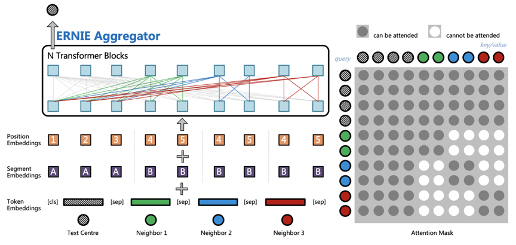
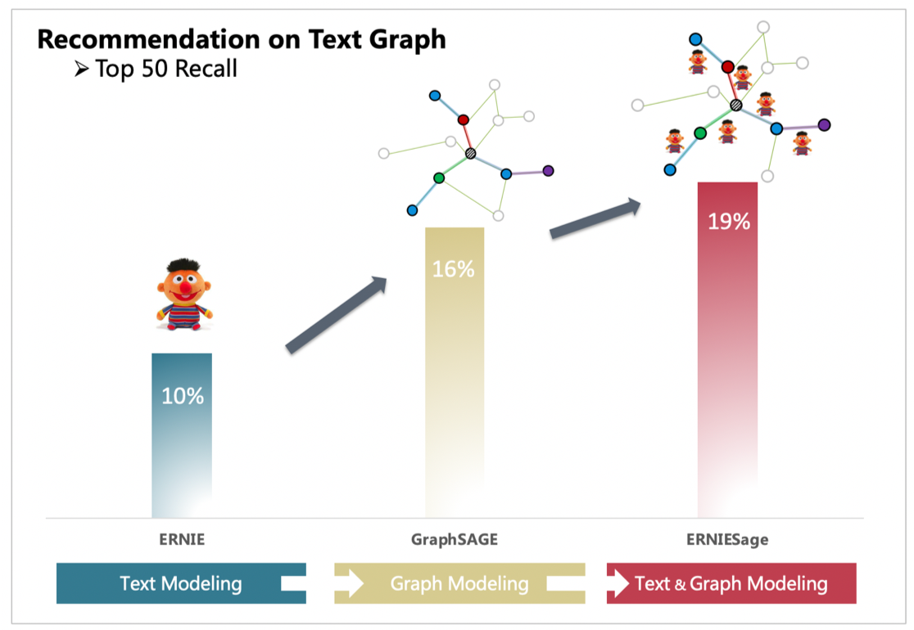

# ERNIESage in PGL

[中文版 README](./README.md)


## Introduction
In many industrial applications, there is often a special graph shown below: Text Graph. As the name implies, the node attributes of such graph consist of text, and the edges provide structural information. Take the search scenario for example, nodes can be expressed by search query, web page titles, and web page content, while the edges are constructed by user feedback or hyperlink information.


**ERNIESage** (abbreviation of ERNIE SAmple aggreGatE), a model proposed by the PGL team, effectively improves the performance on text graph by simultaneously modeling text semantics and graph structure information. It's worth mentioning that [**ERNIE**](https://github.com/PaddlePaddle/ERNIE) in **ERNIESage** is a continual pre-training framework for language understanding launched by Baidu.

**ERNIESage** is an aggregation of ERNIE and GraphSAGE. Its structure is shown in the figure below. The main idea is to use ERNIE as an aggregation function (Aggregators) to model the semantic and structural relationship between its own nodes and neighbor nodes. In addition, for the position-independent characteristics of neighbor nodes, attention mask and independent position embedding mechanism for neighbor blindness are designed.



GraphSAGE with ID feature can only model the graph structure information, while ERNIE can only deal with the text. With the help of PGL, the proposed **ERNIESage** model can combine the advantages of both models. Take the following recommendation example of text graph, we can see that **ERNIESage** achieves the best performance when compared to single ERNIE model or GraphSAGE model.



Thanks to the flexibility and usability of PGL, **ERNIESage** can be quickly implemented under PGL's Message Passing paradigm. Acutally, there are four PGL version of ERNIESage:

- **ERNIESage v1**: ERNIE is applied to the NODE of the text graph;
- **ERNIESage v2**: ERNIE is applied to the EDGE of the text graph;
- **ERNIESage v3**: ERNIE is applied to the first order neighbors and center node;
- **ERNIESage v4**: ERNIE is applied to the N-order neighbors and center node.


## Dependencies
- paddlepaddle>=1.7
- pgl>=1.1

## Dataformat
In the example data ```data.txt```, part of NLPCC2016-DBQA is used, and the format is "query \t answer" for each line.
```text
NLPCC2016-DBQA is a sub-task of NLPCC-ICCPOL 2016 Shared Task which is hosted by NLPCC(Natural Language Processing and Chinese Computing), this task targets on selecting documents from the candidates to answer the questions. [url: http://tcci.ccf.org.cn/conference/2016/dldoc/evagline2.pdf]
```

## How to run

We adopt [PaddlePaddle Fleet](https://github.com/PaddlePaddle/Fleet) as our distributed training frameworks ```config/*.yaml``` are some example config files for hyperparameters. Among them, the ERNIE model checkpoint ```ckpt_path``` and the vocabulary ```ernie_vocab_file``` can be downloaded on the [ERNIE](https://github.com/PaddlePaddle/ERNIE) page.

```sh
# train ERNIESage in distributed gpu mode.
sh run_link_predict.sh ./config/erniesage_link_predict.yaml
```

**NOTE**: To help users better understand the ERNIESage Model, we provide a running example in Baidu AIStudio. Please visit here: https://aistudio.baidu.com/aistudio/projectdetail/667443. 

## Hyperparamters

- learner_type: `gpu` or `cpu`; gpu use fleet Collective mode, cpu use fleet Transpiler mode.

## Citation
```
@misc{ERNIESage,
  author = {PGL Team},
  title = {ERNIESage: ERNIE SAmple aggreGatE},
  year = {2020},
  publisher = {GitHub},
  journal = {GitHub repository},
  howpublished = {\url{https://github.com/PaddlePaddle/PGL/tree/master/examples/erniesage},
}
```
