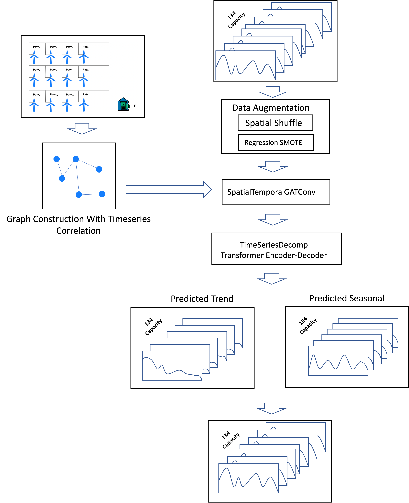

# KDDCup 22 Wind Power Forecasting with Spatial-Temporal Graph Transformer
## Introduction
Wind Power Forecasting (WPF) aims to accurately estimate the wind power supply of a wind farm at different time scales. 
Wind power is one of the most installed renewable energy resources in the world, and the accuracy of wind power forecasting method directly affects dispatching and operation safety of the power grid.
WPF has been widely recognized as one of the most critical issues in wind power integration and operation. 


## Data Description
Please refer to KDD Cup 2022 --> Wind Power Forecast --> Task Definition 
(https://aistudio.baidu.com/aistudio/competition/detail/152/0/introduction)

Download data and place it into `./data`


## Model Training and Testing with the demo script

Minimum usage:
```
    CUDA_VISIBLE_DEVICES=0 python main.py  --conf config.yaml

    # make prediction with toy data
    # put the prediction data into  ./predict_data/test_x and ./predict_data/test_y
    CUDA_VISIBLE_DEVICES=0 python predict.py  --conf config.yaml
```
The trained model will be saved in `output_path` directory. Our model cost about 5 minutes for each epoch tested in Tesla V100 GPU.

## Requirements

```
pgl==2.2.3post0
paddlepaddle-gpu>=2.2.2
```


    
## Model Architecture

We simply design a model as descripted bellows.



## Performance

|        | Dev Score | Max-dev Test Score |
|--------|-----------|--------------------|
| Report |   -       | 47.7               |
| Ours   | 38.93     | 46.83              |

## Prediction Visualization

During Training we visualize the prediction in devided validation and test set. See `val_vis.png` and `test_vis.png`

## Suggest Reading Materials

1. Autoformer: Decomposition Transformers with Auto-Correlation for Long-Term Series Forecasting. [[link]](https://arxiv.org/abs/2106.13008)
2. Wind Farm Power prediction with Graph Neural Network. [[link]](https://aifrenz.github.io/present_file/wind_farm_presentation.pdf)
