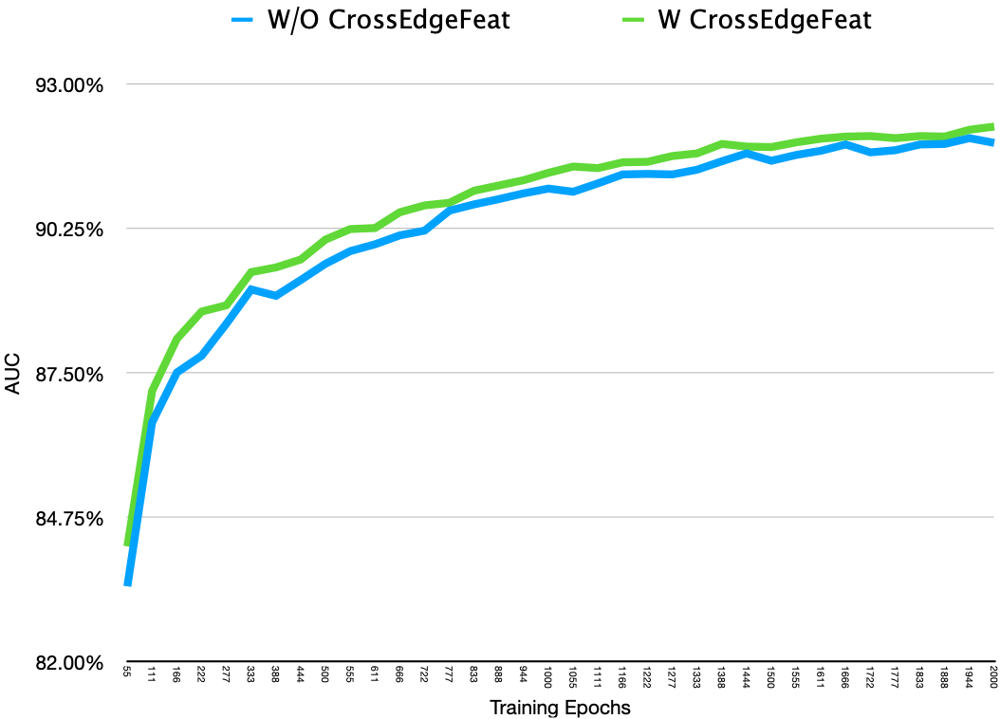

## Masked Label Prediction: Unified Message Passing Model for Semi-Supervised Classification

This experiment is based on stanford OGB (1.2.1) benchmark. The original description of 《Masked Label Prediction: Unified Message Passing Model for Semi-Supervised Classification》 is [avaiable here](https://arxiv.org/pdf/2009.03509.pdf). In this directory, we provide more improvement tricks.


### More Tricks for Improvemnts for OGBN-Proteins


- **Random Partition Size in Evaluation**
  - Random Partition durning training performs like **DropEdge** and we find our model can benefit from this strategy.
  - But in evaluation, we are finding that **Smaller Partition Size** can improve the scores.

```bash
# To compare 

python train.py --place 0 --use_label_e --log_file eval_partition_5 --eval_partition 5

python train.py --place 0 --use_label_e --log_file eval_partition_3 --eval_partition 3
```


- **Using Self-Attention to aggregate Neighbor Feature**
  - The orginal code of UniMP and others like DeeperGCN in OGBN-Proteins use the average edge feature as initial node features. We adopt these module as a learnable aggregator. We sample about 64 edges for each nodes and we use transformer [3 * (Self-Attention + Residual + ReLU + LayerNorm) + Mean Pooling] as aggregator to get the initialize node features. We simply call it **CrossEdgeFeat**. You can find the idea in ```cross_edge_feat.py```
  - Our original implement for ogbn-proteins obteins about **0.9175** validation score and **0.864** test score. And with **CrossEdgeFeat**, we can facilitate fast convergence and achieve higher score.


```bash
# To compare

python train.py --place 0 --use_label_e --log_file with_cross_edge_feat  --cross_edge_feat 3

python train.py --place 0 --use_label_e --log_file without_cross_edge_feat  --cross_edge_feat 0

```

The training curves (Validation AUC) follows:




- **More Training Steps**

  - **OGBN-Proteins is far away from overfitting.** Although we fix the learning rate with 0.001, we run for 5000 epochs and we still can see validation score rising. 
  - **Why don't we increase learning rate?** We have tried another learning rate like 0.01, but we have found that other learning rate converge much slower than 0.001.

  


### Install environment:

```
    git clone https://github.com/PaddlePaddle/PGL.git
    cd PGL
    pip install -e
    pip install -r requirements.txt

```


### To Reproduce the results for proteins dataset:

  1. ```python train.py --place 0 --use_label_e --log_file proteins.log --eval_partition 3 --epoch 5000 --cross_edge_feat 3``` 


Results for each run, you can find the details in ```result.log```

```
Best Validation Test for each Runs

Run0:  Epoch 4888 Valid: 92.58   Test: 86.77
Run1:  Epoch 4500 Valid: 92.49   Test: 86.60
Run2:  Epoch 4666 Valid: 92.58   Test: 86.96
Run3:  Epoch 4555 Valid: 92.53   Test: 87.10
Run4:  Epoch 4611 Valid: 92.49   Test: 87.12
Run5:  Epoch 4888 Valid: 92.76   Test: 87.07
Run6:  Epoch 4333 Valid: 92.47   Test: 87.04
Run7:  Epoch 4333 Valid: 92.69   Test: 86.82
Run8:  Epoch 4944 Valid: 92.64   Test: 86.73
Run9:  Epoch 4944 Valid: 92.61   Test: 86.86

```


### The **detailed hyperparameter** is:

```
Proteins_dataset(Random Partition):
--num_layers                7
--hidden_size               64
--num_heads                 4
--dropout                   0.1
--lr                        0.001
--use_label_e               True
--label_rate                0.5
--cross_edge_feat           3
--cross_edge_feat_max_neigh 64
--eval_partition            3
--train_partition           9
--epoch                     5000
```

### Reference performance for OGB:

| Model                 | Test Accuracy   | Valid Accuracy  | Parameters | Hardware          |
| --------------------- | --------------- | --------------- | ---------- | ----------------- |
| Proteins_baseline     | 0.8611 ± 0.0017 | 0.9128 ± 0.0007 | 1,879,664  | Tesla V100 (32GB) |
| Proteins_UniMP        | 0.8642 ± 0.0008 | 0.9175 ± 0.0007 | 1,909,104  | Tesla V100 (32GB) |
| UniMP + CrossEdgeFeat | 0.8691 ± 0.0018 | 0.9258 ± 0.0009 | 1,959,984  | Tesla V100 (32GB) |


